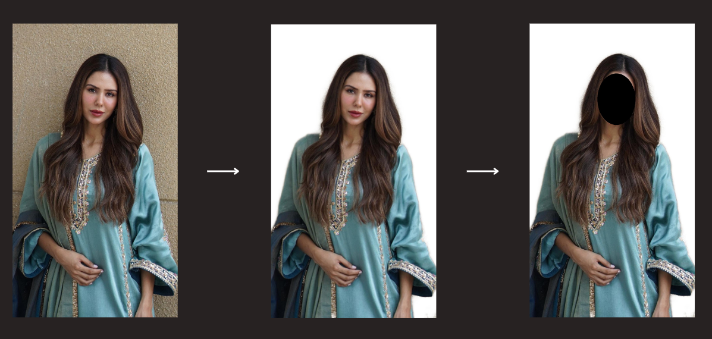

# LoRA Image Preprocessor

## Overview
This Python tool serves as a dedicated preprocessor for images intended for LoRA (Low-Rank Adaptation) training. It automates the detection and blurring of faces or specific regions in both photos and videos. The inspiration for this tool stems from the [Blurry Faces](https://github.com/asmaamirkhan/BlurryFaces) and [remove-photo-background](https://github.com/aryadytm/remove-photo-background) project, and I've tailored a modified version to cater to the unique requirements of LoRA training.

## Demo

### Credits
- [Asmaa Mirkhan](https://github.com/asmaamirkhan) for the original [Blurry Faces](https://github.com/asmaamirkhan) GitHub repository.
- [aryadytm](https://github.com/aryadytm) for the background removal code, sourced from [remove-photo-background](https://github.com/aryadytm/remove-photo-background).

